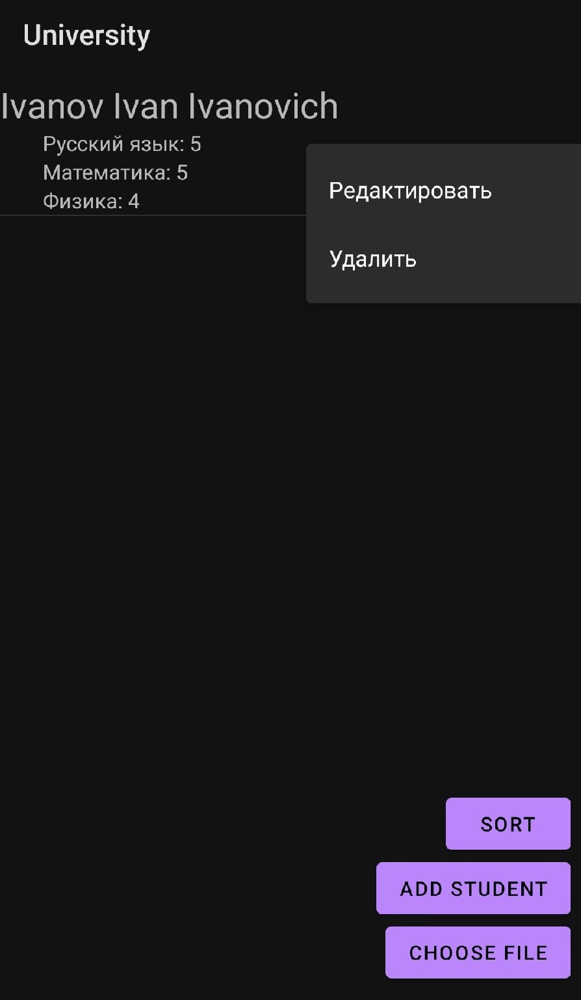

<h1> 
  University
</h1>

  Условие лабораторной: Ведомость абитуриентов, сдавших вступительные экзамены в университет, содержит: Ф.И.О. абитуриента, оценки. Определить средний балл по университету и вывести список абитуриентов, средний балл которых выше среднего балла по университету. Первыми в списке должны идти студенты, сдавшие все экзамены на 5.

<h2>
  Функционал
</h2>
<ol>
  <li>Предусмотрена возможность ввода/вывода элементов в отдельном активити (Add student button).</li>
  <li>Добавлена возможность редактирования списка, удаления отдельных позиций.</li>
  <li>Меню доступных функций показывается по долгому нажатию на элемент списка (функции редактирования и удаления элемента).</li>
  <li>Создан собственный адаптер для списка (StudentAdapter).</li>
  <li>Реализована функция открытия файла и заполнения из него полей списка с помощью парсера (Choose file button).</li>
  <li>Задание варианта (вывести список абитуриентов, средний балл которых выше среднего балла по университету) выполняется по нажатию кнопки Sort</li>
</ol>

  
  

  
  

